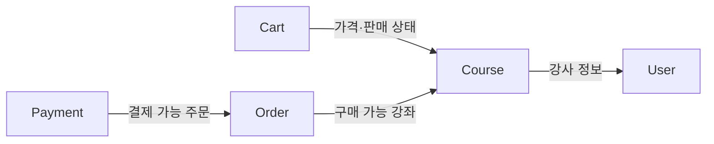

# Bounded Context 경계

## 목적

각 Bounded Context(BC)는 자기 도메인 모델과 비즈니스 규칙을 소유합니다. 다른 BC의 정보가 필요할 때는 상대 BC의 공개된 application port를 사용하고, Entity나 내부 구현에 직접 의존하지 않습니다.

## 현재 조회 관계

| 호출 BC | 제공 BC | 호출 측 Outbound Port | 제공 측 Inbound Port |
| --- | --- | --- | --- |
| Cart | Course | `CartCourseQueryPort` | `CourseQueryToCartUseCase` |
| Order | Course | `OrderCourseQueryPort` | `CourseQueryToOrderUseCase` |
| Payment | Order | `PaymentOrderQueryPort` | `OrderQueryToPaymentUseCase` |
| Course | User | `UserQueryPort` | User 내부 조회 Use Case |

호출 측 adapter가 두 port를 연결합니다. 같은 프로세스 안의 Java 호출이지만, 호출자는 제공 BC의 서비스 구현이나 Entity를 직접 알지 않습니다.

## 경계 모델

응답 모델은 제공 BC가 사용 목적별로 정의합니다.

- Course는 Cart에 `CoursePurchaseInfo`, `CourseSalesInfo`를 제공합니다.
- Course는 Order에 `CoursePrice`를 제공합니다.
- Order는 Payment에 `ChargeableOrder`를 제공합니다.
- 호출 BC는 필요한 경우 응답을 자기 Outbound Port의 모델로 변환합니다.

이 구조는 한 BC의 도메인 모델 변경이 다른 BC로 전파되는 범위를 줄이고, 제공하는 정보와 사용 목적을 인터페이스에 드러냅니다.

## 변경 규칙

- 다른 BC의 Entity, Repository, Service 구현을 직접 참조하지 않습니다.
- 제공 BC의 공개 계약은 application Inbound Port와 전용 응답 모델로 정의합니다.
- 호출 BC의 application 계층은 자기 Outbound Port에 의존하고 adapter가 실제 호출을 연결합니다.
- 새로운 사용자가 기존 계약과 다른 정보나 의미를 요구하면 기존 DTO를 무조건 확장하지 말고 별도 사용 목적의 port/model이 필요한지 검토합니다.
- 단순한 프로세스 내부 호출이라는 현재 조건은 유지하되, 원격 호출이나 메시징 전환은 별도 결정으로 다룹니다.

결정 배경은 [ADR 0001](../adr/0001-protect-bc-boundaries-with-ports.md)을 참고합니다.

