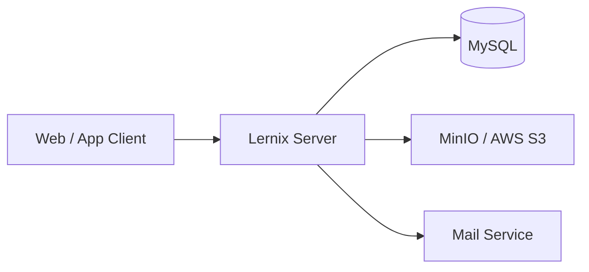

# 아키텍처 개요

## 시스템 형태

Lernix Server는 온라인 강의 도메인을 하나의 Spring Boot 애플리케이션에서 제공하는 모듈러 모놀리스입니다. 모듈은 같은 프로세스와 데이터베이스를 사용하며, 외부에는 HTTP API를 제공합니다.

## 주요 모듈

| 모듈 | 책임 |
| --- | --- |
| User | 회원, 인증, 강사 신청 |
| Category | 강좌 카테고리 |
| Course | 강좌, 섹션, 강의 및 강의 자료 |
| Cart | 구매 후보 강좌 관리 |
| Order | 구매 항목과 주문 금액 확정, 주문 상태 관리 |
| Payment | 결제 준비, 승인, 취소 및 환불 |
| Enrollment | 수강권과 수강 상태 관리 |
| Progress | 학습 진도 관리 |
| Review | 강좌 리뷰 관리 |

`common`은 보안, 예외 처리, 파일 저장소 설정과 공통 도메인 기반 코드를 제공합니다. 공통 영역에 기능별 비즈니스 규칙을 추가하지 않습니다.

## 코드 구조

현재 패키지 구조는 전환 과정에 있습니다.

- Cart, Order, Payment는 `domain`, `application`, `adapter`와 입출력 port를 중심으로 구성됩니다.
- Category, Course, Enrollment, Progress, Review, User는 `presentation`, `application`, `domain`, `infrastructure` 중심의 계층형 구조를 사용합니다.
- 모듈 간 조회는 application port와 adapter 또는 내부 use case를 통해 연결되는 부분이 있습니다.
- 구매 완료 흐름의 모듈 간 상태 변경은 Spring Application Event로 전달됩니다.

새 작업은 변경 대상 모듈의 기존 구조를 우선 따릅니다. 구조를 통일하는 결정은 기능 변경에 섞지 않고 별도의 ADR로 남깁니다.

## 주요 흐름

구매는 Cart, Order, Payment, Enrollment가 책임을 나누어 처리합니다. Payment 승인 후 `PaymentCompletedEvent`, 주문 완료 후 `OrderCompletedEvent`가 같은 애플리케이션 프로세스 안에서 전달됩니다.

자세한 API 순서와 제약은 [구매 흐름](purchase-flow.md)을 참고합니다.

## 데이터와 외부 연동

- 영속성은 Spring Data JPA와 QueryDSL을 사용하며 MySQL에 저장합니다.
- 스키마 변경 파일은 `src/main/resources/db/migration`에서 관리합니다.
- 파일 저장소는 설정에 따라 MinIO 또는 AWS S3를 사용합니다.
- JWT 기반 인증과 Spring Security를 사용합니다.

## 현재 제약

- 모듈은 독립 배포되지 않으며 데이터베이스도 분리되어 있지 않습니다.
- Spring Application Event는 프로세스 내부 이벤트이며 메시지 브로커가 아닙니다.
- 패키지 아키텍처가 모든 모듈에서 동일하지 않습니다.

