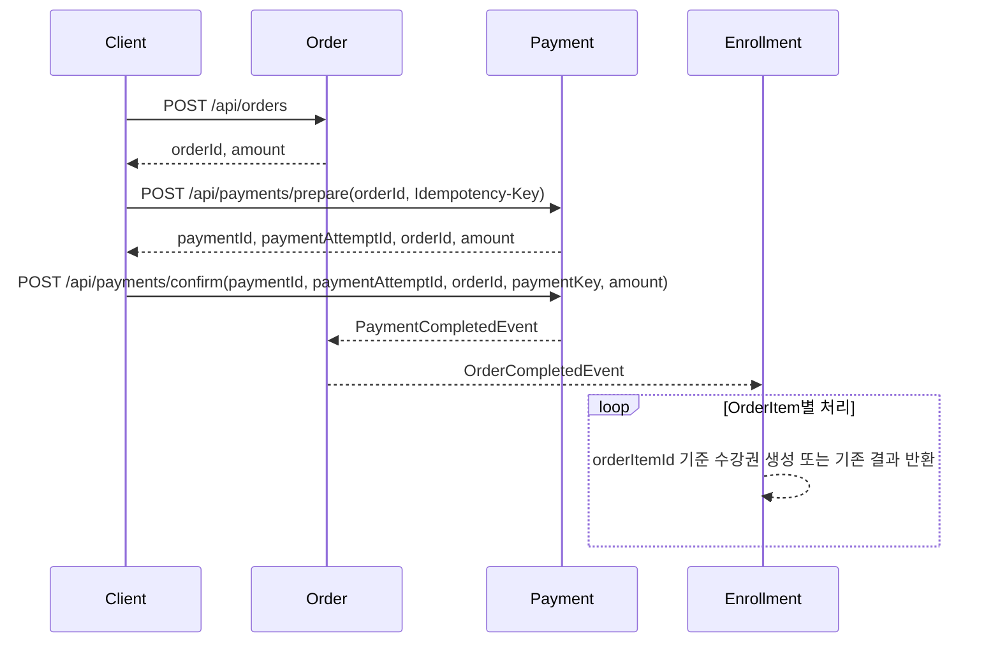

# 구매 흐름

## 목적

구매 흐름은 Order, Payment, Enrollment가 각자 자기 상태 변경을 책임지도록 분리합니다. Payment는 결제 외의 주문 생성이나 수강권 생성을 직접 조율하지 않습니다.

## API 흐름

1. 사용자가 구매할 강좌를 선택합니다.
2. `POST /api/orders`로 주문을 생성합니다.
3. 생성된 `orderId`와 사용자 단위 `Idempotency-Key`로 `POST /api/payments/prepare`를 호출하고 주문별 결제를 식별하는 `paymentId`와 이번 승인 시도를 식별하는 `paymentAttemptId`를 받습니다.
4. PG 승인 후 `paymentId`, `paymentAttemptId`, `orderId`, `paymentKey`, `amount`로 `POST /api/payments/confirm`을 호출합니다.
5. Payment가 최초로 승인된 경우에만 `PaymentCompletedEvent`가 발행되고 Order가 주문을 완료합니다.
6. Order가 최초로 완료된 경우에만 주문 항목 목록을 담은 `OrderCompletedEvent`가 발행되고 Enrollment가 항목별 수강권을 생성합니다.



## 결제 준비 중복 요청 처리

결제 준비 요청은 멱등성 키와 주문별 Payment 상태를 서로 다른 기준으로 보호합니다.

| 요청 상황 | 처리 결과 |
| --- | --- |
| 동일 사용자·키·동일 주문 재요청 | 최초 요청의 `paymentId`, `paymentAttemptId` 반환 |
| 동일 사용자·키·다른 주문 | `409 Conflict` |
| 다른 사용자·동일 키 | 사용자별 독립 요청으로 허용 |
| 서로 다른 키·기존 Payment 동시 요청 | Payment 행 잠금 후 순차 판정, 새 PENDING Attempt는 하나만 허용 |
| 서로 다른 키·최초 Payment 동시 요청 | `order_id` UNIQUE로 하나만 생성하고 충돌 요청은 `409 Conflict` |

기존 Payment가 있으면 root 행을 먼저 비관적 락으로 잠근 뒤 Attempt를 조회합니다. 잠금 대기 중 다른 트랜잭션이 추가한 Attempt까지 확인한 후 새 시도 가능 여부를 판단하기 위해서입니다. Payment가 아직 없으면 잠글 행이 없으므로 `order_id` UNIQUE 제약을 최종 방어선으로 사용합니다.

멱등성 레코드와 Payment 변경은 같은 트랜잭션에서 처리합니다. 따라서 결제 준비가 실패하면 해당 요청이 생성한 `PROCESSING` 레코드도 함께 rollback됩니다.

## 결제 승인 중복 요청 처리

`paymentKey`는 PG 승인 식별자이며 승인 요청의 자연 멱등성 키로 사용합니다. 승인 서비스는 Payment 행을 비관적 락으로 조회해 동일 Payment에 대한 요청을 순서대로 판정합니다.

| 요청 상황 | 처리 결과 |
| --- | --- |
| `paymentAttemptId`, `paymentKey`, `orderId`, `amount`가 모두 같은 승인 재요청 | 성공 응답, 상태 변경과 이벤트 재발행 없음 |
| 승인된 PaymentAttempt에 다른 `paymentKey` 또는 `amount` 사용 | `409 Conflict` |
| 동일 `paymentKey`를 다른 Payment에 사용 | `payment_key` UNIQUE 제약으로 차단하고 `409 Conflict` |
| 동일 승인 요청 동시 실행 | Payment 행 잠금 후 순차 판정, 최초 요청만 상태 변경과 이벤트 발행 |

최초 요청은 `Payment`를 `PAID`, 대상 `PaymentAttempt`를 `APPROVED`로 변경하고 `PaymentCompletedEvent`를 발행합니다. 잠금 대기 후 같은 승인 정보를 확인한 요청은 기존 승인을 성공으로 반환하되 저장과 이벤트 발행을 반복하지 않습니다.

서로 다른 Payment는 서로 다른 행을 잠그므로 Payment 락만으로 전역 `paymentKey` 중복을 막을 수 없습니다. 승인 전 사전 조회도 조회와 저장 사이의 race condition을 제거하지 못하므로 `payment_key` UNIQUE 제약을 최종 방어선으로 사용합니다. 결정 배경은 [ADR 0004](../adr/0004-enforce-payment-key-uniqueness-in-database.md)에 기록합니다.

## 주문 완료 이벤트 중복 처리

Order는 `PaymentCompletedEvent.paymentId`를 주문 완료의 멱등성 기준으로 사용합니다. 이벤트를 처리할 때 Order 행을 비관적 락으로 조회하므로 동일 주문에 대한 동시 처리도 순서대로 판정합니다.

| 이벤트 상황 | 처리 결과 |
| --- | --- |
| `PENDING` Order에 최초 Payment 완료 이벤트 | Order를 `COMPLETED`로 변경하고 `OrderCompletedEvent` 발행 |
| 동일 `paymentId` 이벤트 재처리 | 기존 완료를 성공으로 반환하고 이벤트 재발행 없음 |
| 완료된 Order에 다른 `paymentId` 이벤트 | `409 Conflict` |
| 동일 이벤트 동시 처리 | Order 행 잠금 후 최초 처리만 상태 변경과 이벤트 발행 |

Order의 영속 상태는 기존 `PENDING`, `COMPLETED`, `CANCELED`를 유지합니다. `FIRST_COMPLETION`, `ALREADY_COMPLETED`는 상태가 아니라 이번 호출에서 실제 상태 변경이 발생했는지 표현하는 도메인 행위 결과이며, 서비스가 후속 이벤트 발행 여부를 결정할 때만 사용합니다.

## 수강권 생성 이벤트 중복 처리

하나의 `OrderCompletedEvent`에는 주문에 포함된 여러 `OrderItem`이 들어갈 수 있습니다. Enrollment listener는 각 항목을 순서대로 처리하며, `orderItemId`를 구매 출처이자 소비 멱등성 기준으로 사용합니다.

| 이벤트 항목 상황 | 처리 결과 |
| --- | --- |
| 처음 받은 `orderItemId` | Enrollment 생성 |
| 동일 `orderItemId`, 학생, 강좌 재처리 | 기존 Enrollment ID 반환 |
| 동일 `orderItemId`에 다른 학생 또는 강좌 | `409 Conflict` |
| 다른 `orderItemId`로 동일 학생·강좌 요청 | 기존 중복 수강 정책에 따라 `409 Conflict` |
| 동일 `orderItemId` 동시 생성 | `order_item_id` UNIQUE 제약으로 중복 차단 |

두 UNIQUE 제약의 역할은 다릅니다.

- `order_item_id`: 하나의 구매 항목으로 수강권이 여러 개 생성되는 것을 막고 이벤트 재처리의 기준을 제공합니다.
- `(student_id, course_id)`: 한 학생이 같은 온라인 강좌의 수강권을 중복 보유하지 못하게 합니다.

Enrollment listener 자체에는 전체 항목을 묶는 트랜잭션이 없습니다. 각 `enroll()` 호출이 별도 트랜잭션이므로 첫 번째 수강권이 커밋된 뒤 다음 항목이 실패할 수 있습니다. 같은 이벤트를 다시 처리하면 이미 생성된 항목은 기존 결과를 반환하고 누락된 항목만 생성해 최종 상태로 수렴합니다.

## 모듈 책임

- **Cart**: 구매 후보 강좌를 보관하고 Course의 현재 가격과 판매 상태를 반영합니다.
- **Order**: 구매 항목과 금액을 확정하고 결제 완료에 따라 주문 상태를 변경합니다. 주문 생성 시 Course가 강좌의 존재 여부와 판매 상태를 확인하며, `PUBLISHED` 강좌의 현재 가격만 Order에 제공합니다.
- **Payment**: 주문별 결제 프로세스를 나타내는 Aggregate Root입니다. 개별 PG 승인 시도는 `PaymentAttempt`로 관리하며, 실패 후 재시도하면 같은 Payment 안에 새로운 Attempt를 생성합니다. 승인 요청은 `paymentId`와 `paymentAttemptId`로 Aggregate와 대상 시도를 각각 식별하고, `paymentKey`로 동일 승인 재요청을 판정합니다.
- **Enrollment**: 주문 완료 이벤트를 받아 수강권을 생성하며 Payment를 직접 알지 않습니다. `orderItemId`를 수강권의 구매 출처로 보관해 중복 이벤트를 판정하고, 수강 취소 이벤트에 원래 주문 항목 식별자로 전달합니다.

## 모듈 간 관계

```text
Cart -> Course       현재 가격과 판매 상태 조회
Order -> Course      주문 생성 시 구매 가능 정보 조회
Payment -> Order     결제 가능한 주문 조회
Payment -> Order     PaymentCompletedEvent
Order -> Enrollment OrderCompletedEvent
```

## 현재 제약

- 이벤트는 Spring `ApplicationEvent` 기반이며 같은 프로세스 안에서만 전달됩니다.
- Payment와 Order의 이벤트 listener는 원본 트랜잭션 커밋 이후 실행되므로 상태 변경과 후속 처리가 하나의 원자적 트랜잭션으로 묶이지 않습니다.
- 애플리케이션이 커밋 직후 종료되면 후속 이벤트가 유실될 수 있으며, 재시작 후 복구할 영속 이벤트 저장소가 없습니다.
- Enrollment listener는 `@Async`로 실행되고 `@Retryable`로 `DataAccessException`을 재시도합니다. 여러 주문 항목은 각각 별도 트랜잭션으로 처리됩니다.
- 현재 구현은 중복 전달 시 소비 결과가 변하지 않도록 보호하지만 이벤트 전달 자체를 보장하지는 않습니다.
- 메시지 브로커와 Outbox 패턴은 적용하지 않았습니다.
- 결제 준비 멱등성 레코드의 동일 키 동시 INSERT에서 발생하는 DB UNIQUE 충돌을 기존 결과로 복구하는 기능은 아직 적용하지 않았습니다.
