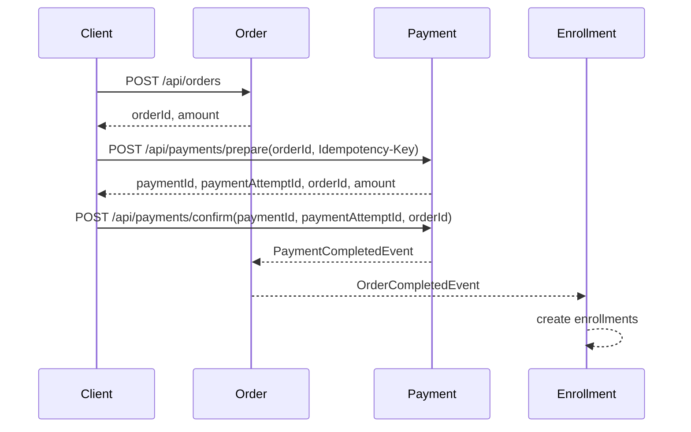

# 구매 흐름

## 목적

구매 흐름은 Order, Payment, Enrollment가 각자 자기 상태 변경을 책임지도록 분리합니다. Payment는 결제 외의 주문 생성이나 수강권 생성을 직접 조율하지 않습니다.

## API 흐름

1. 사용자가 구매할 강좌를 선택합니다.
2. `POST /api/orders`로 주문을 생성합니다.
3. 생성된 `orderId`와 사용자 단위 `Idempotency-Key`로 `POST /api/payments/prepare`를 호출하고 주문별 결제를 식별하는 `paymentId`와 이번 승인 시도를 식별하는 `paymentAttemptId`를 받습니다.
4. PG 승인 후 `paymentId`, `paymentAttemptId`, `orderId`로 `POST /api/payments/confirm`을 호출합니다.
5. `PaymentCompletedEvent`가 발행되고 Order가 주문을 완료합니다.
6. `OrderCompletedEvent`가 발행되고 Enrollment가 수강권을 생성합니다.



## 결제 준비 중복 요청 처리

결제 준비 요청은 멱등성 키와 주문별 Payment 상태를 서로 다른 기준으로 보호합니다.

| 요청 상황 | 처리 결과 |
| --- | --- |
| 동일 사용자·키·동일 주문 재요청 | 최초 요청의 `paymentId`, `paymentAttemptId` 반환 |
| 동일 사용자·키·다른 주문 | `409 Conflict` |
| 다른 사용자·동일 키 | 사용자별 독립 요청으로 허용 |
| 서로 다른 키·기존 Payment 동시 요청 | Payment 행 잠금 후 순차 판정, 새 PENDING Attempt는 하나만 허용 |
| 서로 다른 키·최초 Payment 동시 요청 | `order_id` UNIQUE로 하나만 생성하고 충돌 요청은 `409 Conflict` |

기존 Payment가 있으면 root 행을 먼저 비관적 락으로 잠근 뒤 Attempt를 조회합니다. 잠금 대기 중 다른 트랜잭션이 추가한 Attempt까지 확인한 후 새 시도 가능 여부를 판단하기 위해서입니다. Payment가 아직 없으면 잠글 행이 없으므로 `order_id` UNIQUE 제약을 최종 방어선으로 사용합니다.

멱등성 레코드와 Payment 변경은 같은 트랜잭션에서 처리합니다. 따라서 결제 준비가 실패하면 해당 요청이 생성한 `PROCESSING` 레코드도 함께 rollback됩니다.

## 모듈 책임

- **Cart**: 구매 후보 강좌를 보관하고 Course의 현재 가격과 판매 상태를 반영합니다.
- **Order**: 구매 항목과 금액을 확정하고 결제 완료에 따라 주문 상태를 변경합니다. 주문 생성 시 Course가 강좌의 존재 여부와 판매 상태를 확인하며, `PUBLISHED` 강좌의 현재 가격만 Order에 제공합니다.
- **Payment**: 주문별 결제 프로세스를 나타내는 Aggregate Root입니다. 개별 PG 승인 시도는 `PaymentAttempt`로 관리하며, 실패 후 재시도하면 같은 Payment 안에 새로운 Attempt를 생성합니다. 승인 요청은 `paymentId`와 `paymentAttemptId`로 Aggregate와 대상 시도를 각각 식별합니다.
- **Enrollment**: 주문 완료 이벤트를 받아 수강권을 생성하며 Payment를 직접 알지 않습니다.

## 모듈 간 관계

```text
Cart -> Course       현재 가격과 판매 상태 조회
Order -> Course      주문 생성 시 구매 가능 정보 조회
Payment -> Order     결제 가능한 주문 조회
Payment -> Order     PaymentCompletedEvent
Order -> Enrollment OrderCompletedEvent
```

## 현재 제약

- 이벤트는 Spring `ApplicationEvent` 기반이며 같은 프로세스 안에서만 전달됩니다.
- 이벤트 listener는 트랜잭션 커밋 이후 실행되므로 후속 처리까지 하나의 원자적 트랜잭션으로 묶이지 않습니다.
- Enrollment listener는 `@Retryable`로 일부 데이터 접근 장애를 재시도합니다.
- 메시지 브로커와 Outbox 패턴은 적용하지 않았습니다.
- 동일 키 동시 INSERT에서 발생하는 DB UNIQUE 충돌을 기존 결과로 복구하는 기능은 아직 적용하지 않았습니다.
