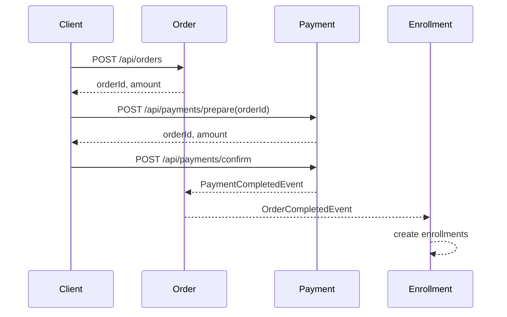

# 구매 흐름

## 목적

구매 흐름은 Order, Payment, Enrollment가 각자 자기 상태 변경을 책임지도록 분리합니다. Payment는 결제 외의 주문 생성이나 수강권 생성을 직접 조율하지 않습니다.

## API 흐름

1. 사용자가 구매할 강좌를 선택합니다.
2. `POST /api/orders`로 주문을 생성합니다.
3. 생성된 `orderId`로 `POST /api/payments/prepare`를 호출합니다.
4. PG 승인 후 `POST /api/payments/confirm`을 호출합니다.
5. `PaymentCompletedEvent`가 발행되고 Order가 주문을 완료합니다.
6. `OrderCompletedEvent`가 발행되고 Enrollment가 수강권을 생성합니다.



## 모듈 책임

- **Cart**: 구매 후보 강좌를 보관하고 Course의 현재 가격과 판매 상태를 반영합니다.
- **Order**: 구매 항목과 금액을 확정하고 결제 완료에 따라 주문 상태를 변경합니다. 주문 생성 시 Course가 강좌의 존재 여부와 판매 상태를 확인하며, `PUBLISHED` 강좌의 현재 가격만 Order에 제공합니다.
- **Payment**: 결제 준비, 승인, 취소, 환불을 담당하고 승인 후 결제 완료 이벤트를 발행합니다.
- **Enrollment**: 주문 완료 이벤트를 받아 수강권을 생성하며 Payment를 직접 알지 않습니다.

## 모듈 간 관계

```text
Cart -> Course       현재 가격과 판매 상태 조회
Order -> Course      주문 생성 시 구매 가능 정보 조회
Payment -> Order     결제 가능한 주문 조회
Payment -> Order     PaymentCompletedEvent
Order -> Enrollment OrderCompletedEvent
```

## 현재 제약

- 이벤트는 Spring `ApplicationEvent` 기반이며 같은 프로세스 안에서만 전달됩니다.
- 이벤트 listener는 트랜잭션 커밋 이후 실행되므로 후속 처리까지 하나의 원자적 트랜잭션으로 묶이지 않습니다.
- Enrollment listener는 `@Retryable`로 일부 데이터 접근 장애를 재시도합니다.
- 메시지 브로커와 Outbox 패턴은 적용하지 않았습니다.
