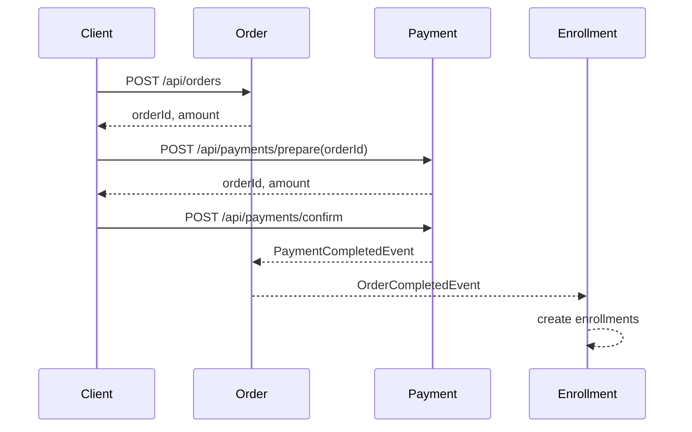

# Purchase Flow Overview

## 목적

기존 구매 흐름은 `PaymentService`가 주문 생성, 주문 완료, 수강권 생성을 함께 조율했다.
이 구조는 Payment BC가 결제 외의 구매 흐름까지 알게 만든다.

현재 구조는 Order, Payment, Enrollment가 각자 자기 상태 변경을 책임지도록 분리한다.

## API 흐름

```text
1. 사용자가 구매할 강좌를 선택한다.
2. POST /api/orders 로 주문을 생성한다.
3. 생성된 orderId로 POST /api/payments/prepare 를 호출한다.
4. PG 승인 후 POST /api/payments/confirm 을 호출한다.
5. PaymentCompletedEvent가 발행된다.
6. Order가 주문을 완료한다.
7. OrderCompletedEvent가 발행된다.
8. Enrollment가 수강권을 생성한다.
```

## Sequence



## BC 책임

### Cart

- 구매 후보 강좌를 임시 보관한다.
- Course 정보를 조회해 현재 가격과 판매 상태를 반영한다.

### Order

- 구매할 항목과 주문 금액을 확정한다.
- 결제 완료 이벤트를 반영해 주문 상태를 `COMPLETED`로 전이한다.
- 수강권 생성에 필요한 주문 항목 정보를 `OrderCompletedEvent`로 발행한다.

### Payment

- 결제 준비, 승인, 취소, 환불을 책임진다.
- Order를 생성하지 않는다.
- Enrollment를 생성하지 않는다.
- 결제 승인 후 `PaymentCompletedEvent`만 발행한다.

### Enrollment

- `OrderCompletedEvent`를 기반으로 수강권을 생성한다.
- Payment BC를 직접 알지 않는다.

## Context Map 요약

```text
Cart -> Course
- Course 정보 조회
- Customer/Supplier 또는 ACL 후보

Order -> Course
- 주문 생성 시 가격 조회
- Customer/Supplier

Payment -> Order
- 결제 준비 시 결제 가능한 주문 조회
- Customer/Supplier

Payment -> Order
- PaymentCompletedEvent
- Published Language

Order -> Enrollment
- OrderCompletedEvent
- Published Language
```

## 현재 한계

- 현재 이벤트는 Spring `ApplicationEvent` 기반이다.
- 동일 프로세스 내 이벤트이며 메시지 브로커는 아니다.
- Outbox 패턴은 아직 적용하지 않았다.
- 이벤트 발행/처리의 원자성은 제한적이다.
- Enrollment listener는 `@Retryable`로 일부 장애를 보완한다.
- MSA 전환 시 이벤트 스키마와 메시지 브로커 기반으로 재정의해야 한다.

## 후속 작업

- 이벤트 소유권 패키지 정리 검토
  - `common.event` -> `payment.application.event`, `order.application.event`
- 이벤트 통합 테스트 추가
- Outbox 패턴 검토
- Context Map을 별도 문서로 확장
